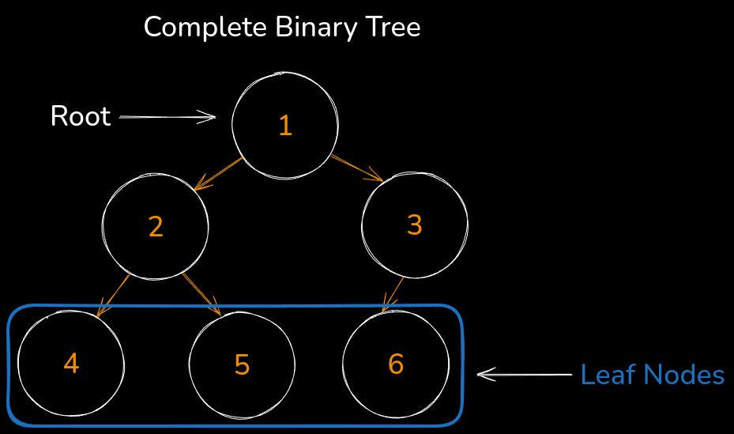
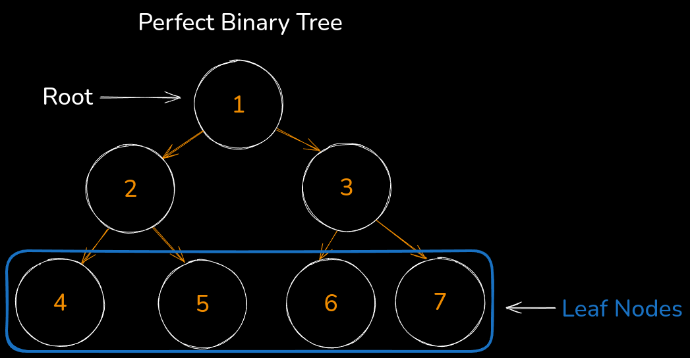
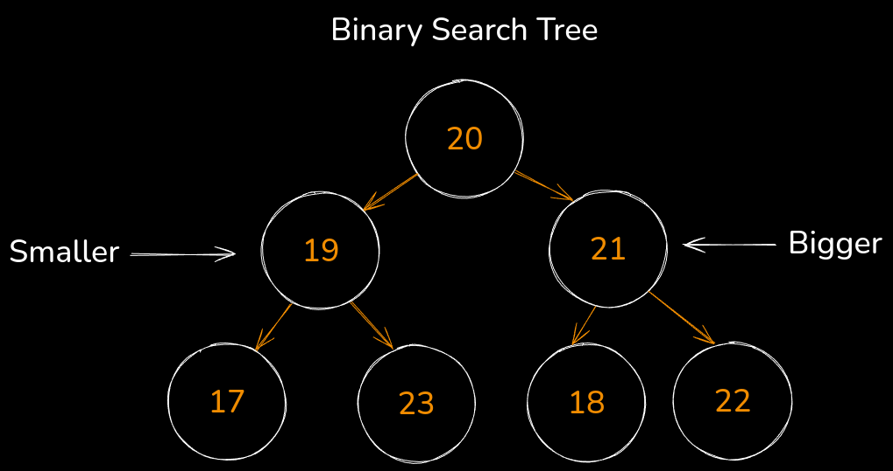

# Rocket Science
This is a repository full of implementations for common algorithms and data structures.  These are written in TypeScript and provide comments to help you understand what's happening.


# Tables of Contents

* [General Resources I Like](#general-resources-i-like)
  * [Articles](#articles)
  * [Books](#books)
  * [Playlists](#playlists)
  * [Websites](#websites)
  * [YouTube](#youtube)
* [How to Use](#how-to-use)
* [Time & Space Complexity](#time--space-complexity)
* [Algorithms](#algorithms)
  * [Search](#search)
    * [Binary Search](#binary-search)
  * [Sliding Window](#sliding-window)
    * [Max Sub Array](#max-sub-array)
  * [Sort](#sort)
    * [Bubble Sort](#bubble-sort)
    * [Insertion Sort](#insertion-sort)
    * [Merge Sort](#merge-sort)
    * [Quick Sort](#quick-sort)
  * [Sum](#sum)
    * [Two Sum](#two-sum)
  * [Traversal DFS](#traversal-dfs)
    * [Preorder](#preorder)
* [Data Structures](#data-structures)
  * [List](#list)
    * [Queue](#queue)
    * [Singly Linked List](#singly-linked-list)
    * [Stack](#stack)
  * [Tree](#tree)
    * [Binary Search Tree](#binary-search-tree)

# General Resources I Like 
There are some general resources out there that I like -- various YouTube channels, articles and the like.  Feel free to look through them:

## Articles
* [Extra, Extra - Read All About It: Nearly All Binary Searches and Mergesorts are Broken](https://research.google/blog/extra-extra-read-all-about-it-nearly-all-binary-searches-and-mergesorts-are-broken/)

## Books
* [Grokking Algorithms, Second Edition](https://www.amazon.com/Grokking-Algorithms-Second-Aditya-Bhargava/dp/1633438538)

## Playlists
* [Data Structures & Algorithms in Python - The Complete Pathway](https://www.youtube.com/watch?v=aWKEBEg55ps&list=PLKYEe2WisBTFEr6laH5bR2J19j7sl5O8R)

## Websites
* [AlgoMap](https://algomap.io/)

## YouTube
* [Greg Hogg](https://www.youtube.com/@GregHogg)
* [NeetCode](https://www.youtube.com/@neetcode)
* [ThePrimeTimeagen](https://www.youtube.com/@ThePrimeTimeagen)

# Time & Space Complexity
It's important to know about Time & Space Complexity to understand how these algorithms perform as their input grows.  Check out [Time & Space Complexity - Big O Notation](https://youtu.be/aWKEBEg55ps?si=VvR7Yymf97-RwK1T) by Greg Hogg.


# How to Use 
This repository is simple and doesn't require much in the way of usage.  You need `Node.js` installed and need to run `npm install` to get everything installed.  Then you can use the following:

* `npm run build` for building the project
* `npm run test` to run unit tests
* `npm run debug` to debug in Google Chrome (remember to use debugger statement)


# Algorithms
You can find all of these implementations at [./src/algorithms](./src/algorithms)


## Traversal DFS 
You can find all of these implementations at [./src/algorithms/traversal/dfs](./src/algorithms/traversal/dfs)

Depth-First Search (DFS) is a graph or tree traversal algorithm that explores as far down a branch as possible before backtracking. It starts at a source node and explores each branch of the graph or tree by visiting child nodes recursively or using a stack for the iterative version.

## Preorder 
You can find the implementation of Traversal Depth First Search Preorder at [./src/algorithms/traversal/dfs/preorder](./src/algorithms/traversal/dfs/preorder/index.ts)

Pre-order Depth-First Search (DFS) is a tree traversal technique where you visit nodes in a specific order: first the current node, then its left subtree, followed by its right subtree. This traversal explores the entire left branch before moving to the right branch -- `node` -> `left` -> `right`.

### Steps
For the binary tree:

```
    1
   / \
  2   3
 / \
4   5
```

The pre-order traversal would be:

* Start at the root `1`.
* Traverse the left subtree:
  * Visit `2`, then its left child `4` and right child `5`
* Traverse the right subtree:
  * Visit `3`

Result would be `[1, 2, 4, 5, 3]`.

### Time Complexity:
`O(n)`, where `n` is the number of nodes, because each node is visited exactly once.

### Use Cases:
Pre-order traversal is useful in scenarios where you need to explore nodes before their children, such as copying a tree, expression tree evaluation, or when you need to preserve node hierarchy in your traversal.

### Resources
* [Binary Trees & Binary Search Trees - DSA Course in Python Lecture 8](https://www.youtube.com/watch?v=EPwWrs8OtfI)


## Sum
You can find all of these implementations at [./src/algorithms/sum](./src/algorithms/sum)

## Two Sum 
You can find the implementation of Two Sum at [./src/algorithms/sum/two-sum/index.ts](./src/algorithms/sum/two-sum/index.ts)

Two Sum problem involves finding two numbers in an array that add up to a given target. The goal is to return the indices of these two numbers.  A common, optimized approach uses a hash map to store the numbers and their indices as you iterate through the array. For each number, you calculate the complement (target minus the current number) and check if it's already in the map. If it is, you return the indices of the complement and the current number. 

### Steps
* Iterate through the array while keeping track of each number's complement (target minus the current number)
* Use a hash map to store the numbers and their indices as you go
* For each number, check if its complement already exists in the hash map
* If found, return the indices of the complement and the current number

### Example:
For an array `[2, 7, 11, 15]` and target `9`:

* Complement of `2` is `7`, store `2` in the map
* Complement of `7` is `2`, which is already in the map
* Return indices `[0, 1]`.

### Time Complexity
`O(n)`, where n is the number of elements, because the array is traversed once, and hash map operations take constant time.  Two Sum is efficient for large datasets due to its use of a hash map, making it a common interview question and practical solution for sum-based problems.

### Resources
* Python implementation - [Short](https://www.youtube.com/shorts/pFag4mBsO1I)
* Python implementation - [Short](https://www.youtube.com/shorts/ysifKoOZw5g)
* [Leetcode 1](https://leetcode.com/problems/two-sum/description/)


## Search
You can find all of these implementations at [./src/algorithms/search](./src/algorithms/search)

## Binary Search
You can find the implementation of Binary Search at [./src/algorithms/search/binary-search/index.ts](./src/algorithms/search/binary-search/index.ts)

Binary Search is an efficient algorithm used to find the position of a target value within a _sorted_ array.  Search faster for great good!  It works by repeatedly dividing the search interval in half. If the *target value is less* than the middle element, you eliminate everything above the middle element.  If *target value is greater* than the middle element, you eliminate everything below the middle element. This process repeats until the target is found or the interval is empty.

### Steps
* Start with the entire sorted array
* Compare the middle element with the target value
* If the target equals the middle element, return its index
* If the target is smaller than the middle element, repeat the search on the left half
* If the target is larger, repeat the search on the right half
* Continue this process until the target is found or the array can no longer be divided

### Example
For a sorted array `[1, 3, 5, 7, 9]` and target `7`:

* Compare with middle element `5`, target is larger, search right half
* Compare with middle element `7`, target is found, return index `3`.

### Time Complexity
Binary search operates in `O(log n)` time complexity, making it much faster than linear search for large datasets, but it requires the data to be sorted.  `O(log n)`, where n is the number of elements, because the search space is halved with each step.

### Resources
* JavaScript implementation - [Binary Search in 100 Seconds](https://www.youtube.com/watch?v=MFhxShGxHWch)
* Python implementation - [Binary Search - Leetcode 704 - Python](https://www.youtube.com/watch?v=s4DPM8ct1pI)
* [Leetcode 704](https://leetcode.com/problems/binary-search/description/)

## Sliding Window
You can find all of these implementations at [./src/algorithms/sliding-window](./src/algorithms/sliding-window)

## Max Sub Array
You can find the implementation of Max Sub Array at [./src/algorithms/sliding-window/max-sub-array/index.ts](./src/algorithms/sliding-window/max-sub-array/index.ts)

The Max Sub Array problem involves finding the contiguous subarray within a given array of integers that has the largest sum.

### Steps:
* Start from the first element and keep a running sum of the current sub array
* If the running sum becomes negative, reset it to the current element (because a negative sum would reduce the overall max)
* Track the max sum encountered during the process
* Continue until all elements have been processed

### Example:
For an array `[-2, 1, -3, 4, -1, 2, 1, -5, 4]`, the max sub array is `[4, -1, 2, 1]`, with a sum of `6`.

### Time Complexity:
`O(n)`, where n is the number of elements, using Kadane's Algorithm, which processes each element once.  The max sub array problem is useful in scenarios that require finding the largest sum in a sequence of numbers, such as financial analyses or performance evaluations.

### Resources
* Python implementation - [Maximum Subarray - Amazon Coding Interview Question - Leetcode 53 - Python](https://www.youtube.com/watch?v=5WZl3MMT0Eg)
* Kadane's Algorithm - [Kadane's Algorithm to Maximum Sum Subarray Problem](https://www.youtube.com/watch?v=86CQq3pKSUw)
* [Leetcode 53](https://leetcode.com/problems/maximum-subarray/description/)

## Sort
You can find all of these implementations at [./src/algorithms/sort](./src/algorithms/sort)

## Bubble Sort
You can find the implementation of Bubble Sort at [./src/algorithms/sort/bubble-sort/index.ts](./src/algorithms/sort/bubble-sort/index.ts)

Bubble sort is a simple, comparison-based sorting algorithm that repeatedly steps through the list, compares adjacent elements, and swaps them if they are in the wrong order. This process continues until no more swaps are needed, meaning the list is sorted.  Bubble sort is not efficient for large datasets, but it’s easy to understand and implement, making it useful for educational purposes.

### Steps:
* Starting from the beginning of the list, compare each pair of adjacent elements
* If the current element is greater than the next, swap them
* Continue this process for all elements. After each pass, the largest element "bubbles" to its correct position
* Repeat until the entire list is sorted

### Example:
For an array `[5, 3, 8, 4, 2]`:

* Compare 5 and 3, swap -> `[3, 5, 8, 4, 2]`
* Compare 5 and 8, no swap
* Compare 8 and 4, swap -> `[3, 5, 4, 8, 2]`
* Continue until the array is sorted -> `[2, 3, 4, 5, 8]`

### Time Complexity:
* Worst and Average case: `O(n²)` (when the array is in reverse order or random)
* Best case: `O(n)` (when the array is already sorted)

### Resources
* Java implementation - [Learn Bubble Sort in 7 minutes](https://www.youtube.com/watch?v=Dv4qLJcxus8)


## Insertion Sort
You can find the implementation of Insertion Sort at [./src/algorithms/sort/insertion-sort/index.ts](./src/algorithms/sort/insertion-sort/index.ts)

Insertion Sort is a simple, comparison-based sorting algorithm that builds a sorted array (or list) one element at a time by repeatedly picking an element from the unsorted portion and inserting it into its correct position in the sorted portion.

### Steps:
* Start from the second element (assuming the first is already sorted)
* Compare the current element with the elements in the sorted portion
* Shift elements in the sorted portion to the right to create space
* Insert the current element into its correct position.
* Repeat until all elements are sorted

### Example:
For an array `[5, 3, 8, 4, 2]`:

* First, `3` is inserted before `5`, resulting in `[3, 5, 8, 4, 2]`
* Then `8` stays in place, and `4` is inserted between `3` and `5`
* Finally, `2` is inserted at the start, giving `[2, 3, 4, 5, 8]`

### Time Complexity:
* Best case: `O(n)` (when the array is already sorted)
* Worst and Average case: `O(n²)` (when the array is in reverse order or random)

### Use Cases:
Insertion sort is efficient for small datasets or arrays that are already mostly sorted. It's easy to implement and understand but not suitable for large datasets due to its quadratic time complexity.

### Resources
* Java Implementation - [Learn Insertion Sort in 7 minutes](https://www.youtube.com/watch?v=8mJ-OhcfpYg)


## Merge Sort
You can find the implementation of Merge Sort at [./src/algorithms/sort/merge-sort/index.ts](./src/algorithms/sort/merge-sort/index.ts)

Merge Sort is a comparison-based sorting algorithm that follows the divide-and-conquer approach. It divides the array into smaller subarrays, sorts them individually, and then merges them back together in sorted order.

### Steps:
* Divide the array into two halves until each subarray has only one element
* Recursively sort each half
* Merge the two sorted halves by comparing elements and arranging them in the correct order
* Repeat the merging process until all subarrays are combined into a fully sorted array.

### Example:
For an array `[3, 1, 4, 1, 5, 9, 2, 6]`:

* Divide into `[3, 1, 4, 1]` and `[5, 9, 2, 6]`
* Recursively divide and sort each half.
* Merge sorted subarrays to get the fully sorted array [1, 1, 2, 3, 4, 5, 6, 9].

### Time Complexity:
* `O(n log n)` in all cases (best, worst, and average), making it highly efficient for large datasets

### Use Cases
Merge Sort is stable and guarantees optimal performance, making it ideal for sorting linked lists or for scenarios where guaranteed `O(n log n)` performance is required. However, it requires additional memory for the merging process.

## Resources
* Java Implementation - [Learn Merge Sort in 13 Minutes](https://www.youtube.com/watch?v=3j0SWDX4AtU)


## Quick Sort
You can find the implementation of Quick Sort at [./src/algorithms/sort/quick-sort/index.ts](./src/algorithms/sort/quick-sort/index.ts)

Quick Sort is a highly efficient, comparison-based sorting algorithm that uses the divide-and-conquer approach to sort elements. It works by selecting a "pivot" element and partitioning the array so that all elements smaller than the pivot come before it, and all elements larger come after it.

### Steps:
* Choose a pivot element from the array (the implementation chooses the last index
* Partition the array by rearranging elements: elements less than the pivot go to its left, and elements greater go to its right
* Recursively apply the same process to the left and right subarrays
* Continue this until each subarray has only one element or is empty, at which point the array is sorted

### Example:
For an array `[3, 6, 8, 10, 1, 2, 1]`:

* Choose 3 as the pivot
* Partition to get `[1, 2, 1]` (less than 3) and `[6, 8, 10]` (greater than `3`)
* Recursively sort the subarrays

### Time Complexity:
* Average case: `O(n log n)`
* Worst case: `O(n²)` (when the pivot is poorly chosen, like the smallest or largest element).

### Use Cases
Quick Sort is known for its fast performance and is widely used in practice, particularly for large datasets, because of its average-case efficiency and in-place sorting.

### Resources
* Java Implementation - [Learn Quick Sort in 13 Minutes](https://www.youtube.com/watch?v=Vtckgz38QHs)


# Data Structures
Here are all of the data structures that are implemented in this repository.

You can find all of these implementations at [./src/data-structures](./src/data-structures)


| Operation                   | Array (static)/List (dynamic) | String (immutable) |
| --------------------------- | ----------------------------- | ------------------ |
| Append to end               | `*O(n)`                       | `O(n)`             |
| Popping from end            | `O(1)`                        | `O(n)`             |
| Insertion, not from end     | `O(n)`                        | `O(n)`             |
| Deletion, not from end      | `O(n)`                        | `O(n)`             |
| Modifying an element        | `O(1)`                        | `O(n)`             |
| Random access               | `O(1)`                        | `O(1)`             |
| Checking if element exists  | `O(n)`                        | `O(n)`             |
 

## List
You can find all of these implementations at [./src/data-structures/list](./src/data-structures/list)

## Queue
You can find the implementation of a Queue at [./src/data-structures/list/queue/index.ts](./src/data-structures/list/queue/index.ts)

A queue is a linear data structure that follows the First In, First Out (FIFO) principle, meaning the first element added to the queue will be the first one to be removed. It is similar to a real-life queue, like waiting in line—those who arrive first get served first.

### Key Operations
* **dequeue**
  * Remove an element from the front of the queue (think shift in arrays)
* **enqueue(value)**
  * Add an element to the back of the queue (think push in arrays)
* **isEmpty**
  * Check if the queue is empty (looks at the length of the array)
* **peek**
  * Retrieve the element at the front of the queue without removing it
* **size**
  * Retrieve the size of the queue

### Use Cases
* Scheduling tasks in operating systems (like managing print jobs or CPU tasks)
* Breadth-First Search (BFS) in graphs
* Message Queuing systems in distributed applications
* Queues are typically implemented using arrays or linked lists and are fundamental in managing tasks that need to be processed in order

### Resources
* [Stacks & Queues - DSA Course in Python Lecture 5](https://www.youtube.com/watch?v=vOx3vY1w4tM)

## Stack
You can find the implementation of a Stack at [./src/data-structures/stack/index.ts](./src/data-structures/list/stack/index.ts)

A stack is a linear data structure that follows the Last In, First Out (LIFO) principle, meaning the last element added to the stack will be the first one removed. It is similar to a stack of plates, where the plate placed on top is the first to be taken off.

### Implemented Methods 
* **isEmpty**
  * Checks to see if stack is empty
* **peak**
  * Returns first element
* **pop**
  * Removes element from the end of the stack
* **push(value)**
  * Add value to the end of the stack

### Use Cases
* Function call stack in programming
* Expression evaluation (e.g., parsing parentheses)
* Backtracking algorithms like Depth-First Search (DFS)
* Stacks can be implemented using arrays or linked lists and are crucial for scenarios where you need to manage data in reverse order

### Resources
* [Stacks & Queues - DSA Course in Python Lecture 5](https://www.youtube.com/watch?v=vOx3vY1w4tM)

## Singly Linked List
You can find the implementation of a Singly Linked List at [./src/data-structures/singly-linked-list/index.ts](./src/data-structures/list/singly-linked-list/index.ts)

A Singly Linked List is a linear data structure made up of nodes, where each node contains two elements:
* **data**: The value or content of the node
* **next**: A link to the next node in the sequence

Unlike arrays, linked lists do not store elements in contiguous memory locations. Instead, each element (node) points to the next location in memory.

### Implemented Methods
* **clear**
  * Clears list entirely
* **pop**
  * Removes last element in the list
* **push(value)**
  * Add element to the end of the list
* **findByIndex(index)**
  * Find a node based on its index
* **findByValue(value)**
  * Find a node based on its value
* **shift**
  * Removes element from the beginning of the list
* **unshift(value)**
  * Add element to the beginning of the list

### Use Cases
* Efficient insertions and deletions at any position
* Dynamic memory allocation where size can grow or shrink as needed

### Resources
* [Linked Lists - Singly & Doubly Linked - DSA Course in Python Lecture 3](https://www.youtube.com/watch?v=dqLHTK7RuIo)


# Tree
You can find all of these implementations at [./src/data-structures/tree](./src/data-structures/tree)

## Binary Search Tree
You can find the implementation of a Binary Search Tree at [./src/data-structures/tree/binary-search-tree/index.ts](./src/data-structures/tree/binary-search-tree/index.ts)

A Binary Search Tree (BST) is a node-based data structure where each node has at most two children, referred to as the left and right child. It is designed to efficiently store and retrieve data in sorted order:

* **left**: Contains nodes with values less than the node’s value (also a binary search tree)
* **right**: Contains nodes with values greater than the node’s value (also a binary search tree)

### Implemented Methods
**insert(value)**:
  * Add a node in its correct position while maintaining the BST property

### Example
The root is `5`, with `3` and `7` as its children:

* `3` has children `2` and `4`
* `7` has children `6` and `8`

### Time Complexity:
* Best/Average case: `O(log n)` for search, insert, and delete
* Worst case: `O(n)`, if the tree becomes unbalanced (e.g., a sorted input)

### Use Cases
Binary Search Trees are commonly used in search-related algorithms and data structures due to their ability to quickly retrieve, insert, and delete elements while maintaining order.

### Resources
* [Binary Trees & Binary Search Trees - DSA Course in Python Lecture 8](https://www.youtube.com/watch?v=EPwWrs8OtfI)

### Visuals



